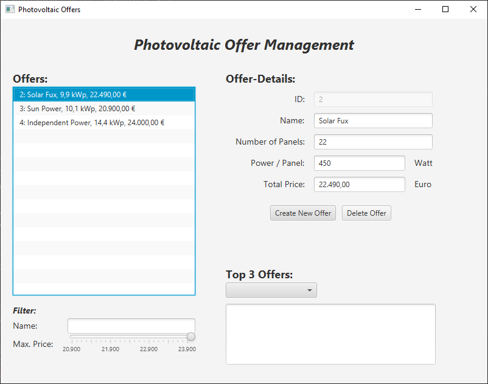
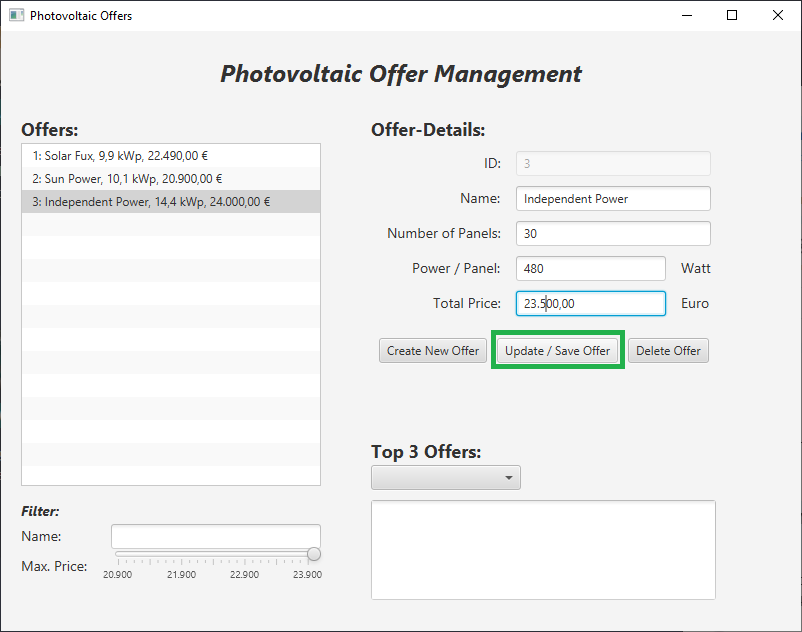
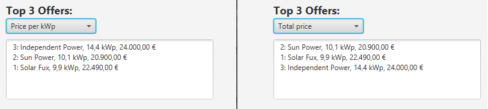

# Test 3AHITM, Photovoltaik-Offert-Manager
:icons: font

## Basisversion (70 %)

Sie sollen eine Anwendung entwickeln, mit der ein Anwender Offerte für die Ausschreibung einer Photovoltaik-Anlage verwalten kann.

.Dabei ist folgender grober Funktionsumfang vorgesehen:

* Anlegen neuer Offerte
* Löschen von Offerten, falls der Bieter zurückgezogen hat

Die eingelangten Offerte sollen in einer Liste dargestellt werden und für eine Detailansicht gewählt werden können.

Um die Übersichtlichkeit zu bewahren sind auch Filter anzubieten. Die Liste soll wie folgt eingeschränkt werden können:

* Namens-Filter mittels Eingabefeld
* Preis-Filter mittels Slider

### Modell

Offerte sollen mittels Singleton-Design-Pattern mit Lazy-Initialisierung angelegt werden können.

.Für jedes Offert (`Offer`) sind folgende Werte abzuspeichern:
* Id +
  Diese ist automatisch zu vergeben.
* Name
* NumberOfPanels +
  Hier wird die Anzahl der Photovoltaik-Panele definiert
* PowerPerPanel +
  Gibt die Leistung eines einzelnen Panels an
* TotalPrice +
  Gesamt-Angebots-Preis

Die Klasse `OfferList` soll sich um die Verwaltung der eingetroffenen Angebote kümmern.

.Stellen Sie hier folgende Methoden bereit:
* `addOffer`
* `updateOffer`
* `deleteOffer`
* `getMaximumPrice`
* `getMinimumPrice`

Implementieren Sie die beiden letztgenannten Methoden mithilfe des Streaming-APIs von Java!

Achten Sie weiters für saubere Datenkapselung!

### GUI

Die View ist bereits in der Datei offers-view.fxml implementiert. +
Bei Bedarf sind Änderungen natürlich möglich.

Setzen Sie die in JavaFX vorgesehenen Möglichkeiten für das DataBinding ein!

.Buttons:
* `Create New Offer` +
  Übernimmt die Daten der Eingabefelder und erstellt daraus ein neues Offert. Das Model ermittelt wieder automatisch eine neue ID dafür.

* `Delete Offer` +
  Entfernt das gewählte Offert aus der Liste.

### Filter

Die Filter sollen sofort reagieren, es ist kein expliziter Button-Klick dafür notwendig.

* **Namens-Filter:** die im Filter eingegebenen Zeichen müssen irgendwo im Anbieter-Namen vorkommen, Position und Groß- und Kleinschreibung sind nicht relevant
* **Preis-Filter:** Über einen Slider ist der maximale Preis einstellbar. +
Der Minimal- und Maximalwert, der im Slider auswählbar ist, soll wiederum von der Gesamt-Offertliste ermittelt werden. Verwenden Sie dazu die Methoden `getMinimumPrice()` und `getMaximumPrice()`. +
 => Also der höchste einstellbare Wert des Sliders ist der Preis des teuersten Offerts.

== Aktualisierung der Offerte (15 %)

Erweitern Sie die oben beschriebene Basisversion um eine Möglichkeit, Datensätze ändern zu können.

Fügen Sie dazu einen weiteren Button `Update/Save Offer` hinzu.

Wird der Button gewählt so ist der gewählte Datensatz mit den aktuellen Eingaben zu aktualisieren.

== Auswertung (15 %)

Es sollen 2 Auswertungen zur Verfügung stehen (Enumeration?):

* `Price per kWp`: +
  Hier erfolgt die Sortierung nach dem Preis pro kWp (Gesamtpreis / Gesamtleistung der Anlage)

* `Total price`: +
  Hier wird nach dem Gesamt-Offertpreis sortiert.

Wird die Auswahl gewechselt, so ist die Auswertung neu zu erstellen. Dabei sollen jeweils maximal 3 Angebote angezeigt werden (eben die Top 3). +

Aus Zeitgründen muss sich dieser Report nicht automatisch aktualisieren, falls sich ein Offert verändert!

IMPORTANT: Verwenden Sie für die Auswertungen zwingend das Java Streaming API!

